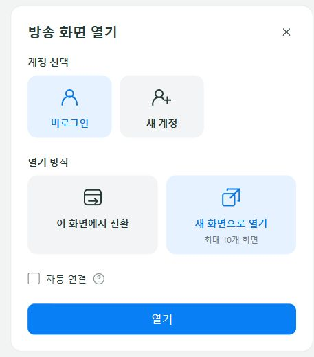
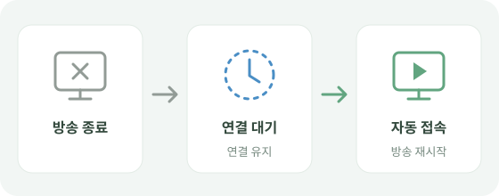
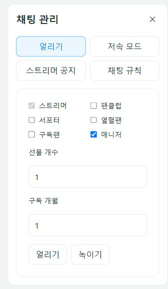
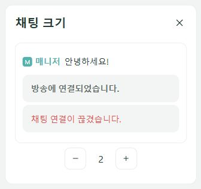
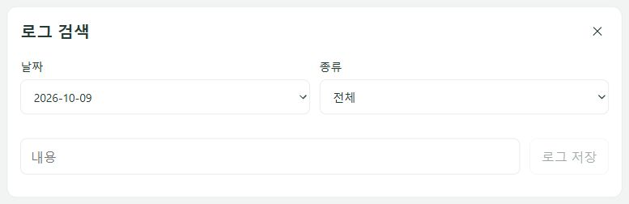
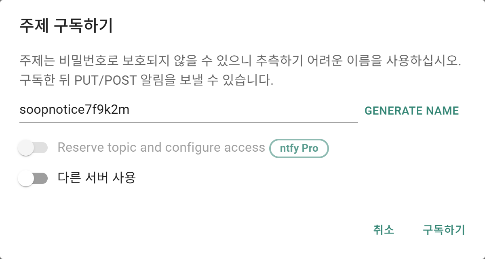
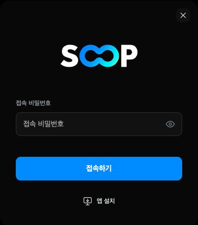
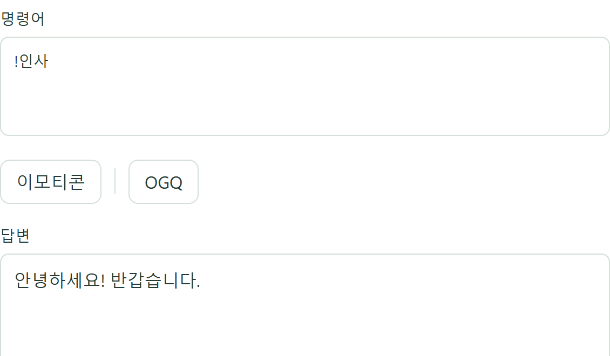

<p align="center">
  
  
  
  
</p>

<h1 align="center">
🌳 SOOP Chat
</h1>

<p align="center">
    <strong>Node.js SOOP Chat</strong>
</p>

<p align="center">
  <a href="https://github.com/obabo0801/SOOP-Chat/archive/refs/heads/main.zip">
    
  </a>
</p>

```bash
git@github.com:obabo0801/SOOP-Chat.git
```

---

<details>
<summary>❗ 업데이트 내역</summary>

## ❗ 버전 1.1.0
- 홈 화면 추가
  - 접속 목록, 인기 LIVE, 추천 LIVE 표시
  - 관심 캐치, VOD, 스토리 표시
- 영상 미리보기 재생 지원
  - LIVE, 다시보기, 클립, 캐치
  - 마우스 올리기, 모바일 화면 위치로 재생
- 닉네임, 아이디 검색 및 검색 결과 화면 추가
  - LIVE, VOD, 게시글, 스트리머 검색
  - 관련 콘텐츠, 캐치 스토리 표시
  - 검색 주소, 메달, 엠블럼 표시
- 방송 화면 연결 기능 추가
  - 계정 선택, 새 계정 로그인
  - 기존 화면 전환, 새 화면 열기
  - 자동 연결, 화면별 비밀번호 설정
- 홈 접속 인증, 당일 인증 유지 지원
- 홈 이동, 팝업 닫기, 뒤로가기 개선
- 프로필 정보, 방송국 게시판 추가
  - 열혈팬, 구독팬, VOD 목록 확인
  - 방송 화면 열기 지원
- 구독티콘, 뱃지, 구독 개월 표시 개선
- 방송과 계정별 매크로, 알림 사용 설정 분리
- 멤버, 일정 매크로 바로 편집 지원
- 알림 목록, 읽음 처리, 정렬, 삭제 기능 추가
- ntfy 호출 알림, 후원 메시지 표시 개선
- 로그 검색 종류, 날짜 선택, 저장 기능 개선
- 시스템 테마, 모바일 화면 구성 개선
  - 채팅 입력, 이모티콘, 키보드 배치 개선
  - 전체화면, 스크린 모드, PiP 개선
- 높은 화질 자동 선택, 버퍼링 복구 개선
- 영상 자막 동기화, 방종 후 계정 표시 개선
- 미션 정산 중복 표시, 팬클럽 오인 표시 수정
- 코드 자동 반영, 비정상 종료 복구 보완
- 미리보기 연결 정리, 설정 파일 오류 처리 개선
- Caddy, Vercel 접속 설정 지원
  - 개인 접속 주소를 `.env`로 분리
  - 첫 실행 시 `.env` 설정 자동 생성

## ❗ 버전 1.0.9
- 로그 검색, 채팅 날짜 구분 추가
- 편집기 로그인, 로그아웃 지원
- 채팅 표시 설정 추가
  - 이모티콘 표시, 움직임, OGQ 크기 설정
  - 입장, 퇴장 숨기기, 채팅 크기 조절
- 채팅 팝업, 화면 지우기 지원, 로그 기록 유지
- 채팅 입력 `/` 명령어 지원, 오타 전송 방지
- 더 보기 설정 팝업, 뒤로가기 추가
- 채팅 관리 기능 확장
  - 매니저 임명, 해임, 강퇴 취소
  - 얼음 등급 설정, 공지, 규칙 수정
  - 참여 인원 검색, 강퇴 인원 조회
- 방송 정보, 영상 저장 추가
- 멀티 모드 실행, 개수 변경, 전체 정지 지원
- ntfy 휴대폰 알림 추가
  - 방송, 채팅, 후원, 게시글, 클립, 캐치 알림
  - 호출 매크로, 전송 결과 답변 지원
  - 편집기 알림 설정 지원
- 외부에서 편집기 접속, 주소 복사 지원
- 후원 표시, 버튼 정렬, 투표 표시 개선
- 시스템, 오류 메시지 표시 개선
- 클립 삭제 오인 알림 수정
- 구독 정보, OGQ 오류 처리 개선
- 규칙 타이머 오류, 미션 정산 중복 답변 수정

## ❗ 버전 1.0.8
- 편집기 영상 재생 추가
  - 화질, 볼륨, 자막 설정
  - 녹화 구간 탐색, 라이브 복귀
  - PIP, 스크린 모드, 단축키 지원
- 편집기 채팅 화면 추가
  - 일반 채팅, 매니저 채팅 지원
  - 이모티콘, OGQ 전송 지원
  - 이전 기록, 채팅 모아보기
  - 프로필, 채금, 강퇴, 귓속말 지원
  - 공지, 채팅 규칙, 투표 표시
- 매크로 답변 미리보기 추가
- 스트리머 정보, 엠블럼 표시 추가
- 고화질 연결 충돌 처리 개선
- 성인 방송 로그인 처리 수정
- 방송 정보 변경 오류 처리 개선
- 채팅 스크롤 유지 개선
- 얼음 상태 타이머 전송 제한
- 룰렛 `?` 항목 출력 제외

## ❗ 버전 1.0.7
- 매크로 편집 화면 추가
  - 이모티콘, OGQ 선택 지원
  - `/매크로 편집` 명령어 추가
- 방송 대기 접속 처리 변경
  - 비로그인 입장 후 2~3분 뒤 로그인
  - 이미 방송 중이면 로그인 후 접속
- 게시글, 클립, 캐치 좋아요 변경 알림 추가
  - 댓글과 답글 좋아요 변경 포함
- 게시글, 댓글 삭제 확인 개선
- 연속 구독 매크로 누락 수정
- 미션 제목 변수 `{제목}` 추가
- 후원 알림 테스트 이미지 표시
- 기본 `.env` 자동 생성
- 코드 스타일 정리

## ❗ 버전 1.0.6
- 채팅 매크로 기능 추가
  - 자동답변, 자동관리, 후원 알림 지원
  - 매니저 채팅에서 명령어 수정 지원
- 채금, 강퇴 채팅 기록 추가
- 후원 알림 테스트 추가
- 임시 닉네임 변경 명령어 추가
- 룰렛 개수 범위 인식 수정
- OGQ 전송 오류 수정
- 명령어 안내, 로그 출력 정리
- 연결 취소, 시간 초과 처리 개선
- 브라우저 로그인, 프록시 기능 제거
- 멀티 설정 변수 `TENANTS`로 변경

## ❗ 버전 1.0.5
- 멀티 기능 추가
- 번호별 로그인 설정 지원
- 접속 유지 모드 추가
- 개별 프록시 설정 지원

## ❗ 버전 1.0.4
- Weflab 룰렛 확률 조회 기능 추가
  - /룰렛 개수 명령어 지원

## ❗ 버전 1.0.3
- 게시글, 클립, 캐치 알림 개선
  - 삭제 및 공개 상태 변경 알림 추가
  - 게시글 삭제 시 잘못된 알림 수정
  - 방송 대기 중 알림 유지
- 댓글과 답글 작성, 수정, 삭제 알림 추가
- PC, 모바일 시청자 수 변경 이벤트 추가
- 방송 스트림 조회 및 숲 패키지 연결 추가
  - 화질 변경 및 오류 시 재연결 처리
- OGQ 선물 수신자 표시 오류 수정
- 방송 정보 갱신, 로그인 및 연결 오류 처리 개선
- 환경변수 처리 및 배포 파일 구성 개선

## ❗ 버전 1.0.2
- 브라우저 로그인 기능 추가
  - 로그인 상태 저장 및 재사용
- SOOP 서비스 점검 메시지 표시
- 로그인 패킷 오류 수정
- 자동 연결 및 세션 오류 처리 개선
- 로그와 환경변수 처리 개선

## ❗ 버전 1.0.1
- 방송 자동 대기 기능 추가
- 방송 상태 안내 메시지 추가
  - 오프라인, 비밀번호, 연령 제한, 플러스 구독
- Bridge 인증 흐름 개선
  - 비밀번호 방송 연결 실패 처리
  - 실패 시 Timeout 문제 수정
  - Bridge 인증 성공 후 Chat 연결
- 스트리머 새 게시글 알림 추가
- 방송 입장 로그와 채팅 참여 로그 분리
- 도전미션 목록 조회 추가
- 대결미션 결과 알림 개선
  - 승리 팀 / 무승부 처리 분리

</details>

---

## 📌 소개
SOOP Live 채팅 구조를 분석하면서 만든  
Node.js 기반 채팅 클라이언트입니다.

공식 라이브러리는 아니며, 개발용으로 사용합니다.

사용 시 [SOOP 서비스 이용 정책](https://developers.sooplive.com/?szWork=support&sub=terms)을 준수해주세요.

---

## ✨ 기능
- Chat WebSocket 방송 채팅 연결
- Bridge WebSocket 방송 정보 수신
- 방송 대기 및 자동 접속
- 방송 제목, 카테고리, 태그 변경 알림
- 일반 채팅, 매니저 채팅, 귓속말 수신
- 참여자 목록 및 입퇴장 처리
- 별풍선, 스티커, 애드벌룬 선물 알림
- 구독권, 퀵뷰, OGQ 선물 알림
- 투표, 도전, 대결미션, 자막 이벤트 처리
- 게시글, 클립, 캐치 변경 알림
- 댓글과 답글 변경 알림
- 게시글, 클립, 캐치 좋아요 변경 알림
  - 댓글과 답글 좋아요 변경 포함
- 시청자 수 변경 알림
- 방송 스트림 조회 및 숲 패키지 연결
- Weflab 룰렛 확률 조회
- 로그인, 2차 로그인, 로그아웃 지원
- 콘솔 명령어 테스트 지원

---

## 🛠 개발 환경
- Node.js (ESM)
- dotenv 17.4.2
- ws 8.21.0

---

## 📦 패키지

```js
import { SoopClient } from 'soop-chat';

const client = new SoopClient({
    bjId: '스트리머 아이디'
});

client.on('chat', data => {
    console.log(`${data.userNick}: ${data.message}`);
});

await client.connect();
```

---

## 🚀 설치
```bash
npm install
```

---

## 🪟 실행
```bash
npm start
```

Windows의 Node 충돌을 줄이기 위해<br>
실행 시 `--no-maglev`를 적용합니다.<br>
`npm start`와 배치 파일 실행은<br>
비정상 종료 시 자동으로 다시 연결합니다.<br>
새 화면과 멀티 모드에도 적용됩니다.<br>
복구 시 접속 주소와 계정을 유지합니다.<br>
정상 종료 시에는 다시 실행하지 않습니다.

| 항목 | 처리 |
| --- | --- |
| 방송 중 실행 | 로그인 후 접속 |
| 대기 후 접속 | 비로그인 입장<br>2~3분 뒤 로그인 |
| 방송 대기 | 5초 간격 확인 |

배치 파일 실행

```bash
start.bat
```

```bash
npm run start:multi -- 3
```

`tenants.json`에서 번호별  
접속 정보를 설정합니다.  
첫 실행 시 연결 개수에 맞춰  
`tenants.json`을 생성합니다.  
미설정 번호는 `.env`의 `BJID`로  
비로그인 접속합니다.  

```bash
npm run stop:multi
```

실행 창에서 `Ctrl+C`로 종료합니다.

---

## 🔐 .env

`.env`는 공개하지 마세요.

`config.json`에 환경변수 이름을 적으면<br>
`.env` 값을 불러와 사용할 수 있습니다.

```env
BJID="WHO_BJID"
BROADPW="WHO_BROADPW"

USERID="YOUR_ID"
PASSWORD="YOUR_PASSWORD"
SECONDPW="YOUR_SECONDPW"

HOST="127.0.0.1"
PORT="0"
ORIGINS=""
ACCESSPW="YOUR_ACCESSPW"

IDLE="true"
# TENANTS="tenants.json"
```

- `IDLE`: 접속 유지 모드
- `TENANTS`: 연결 설정 파일
- `HOST`, `PORT`: 편집기 접속 IP, 포트
- `ORIGINS`: 외부 접속 주소
- `ACCESSPW`: 처음 홈 접속 시 비밀번호

`ORIGINS`는 쉼표 또는 줄바꿈으로<br>
주소를 구분할 수 있습니다.

```env
ORIGINS="
https://example.com
https://example.net
"
```

처음 실행할 때 `.env`가 없으면<br>
기본 설정 파일을 자동 생성합니다.<br>
개인 IP와 접속 주소는<br>
`.env`에만 저장합니다.

## ⚙️ 설정

| 이름 | 설명 |
| --- | --- |
| `bjId` | 방송 스트리머 아이디 |
| `broadPw` | 방송 비밀번호 |
| `auto` | 방송 대기 연결 |
| `delay` | 자동 대기 연결 시간 |
| `cookie` | 로그인 쿠키 .A32... |
| `weflab` | Weflab 사용자 ID |
| `host` | 접속 IP<br>기본 `127.0.0.1` |
| `port` | 시작 포트<br>`0`: 자동 배정 |
| `count` | 화면 개수 제한<br>기본값: 10 |
| `origins` | 허용할 외부 주소 목록 |
| `accessPw` | 홈 접속 비밀번호 |
| `screenPw` | 방송 화면별 접속 비밀번호<br>기본값: 빈 값 |
| `isLink` | 이모티콘 링크 표시 |
| `isList` | 참여자 목록 표시 |
| `pver` | 참여자 목록 및 입퇴장 수신 |
| `subtitle` | 자막 언어 설정 |
| `mode` | 채팅 로그 범위 |

`bjId` 없이 실행하면 홈 화면에서<br>
방송을 선택합니다.<br>
현재 계정 또는 새 계정으로<br>
진행할 수 있습니다.<br>
이 화면에서 전환하거나<br>
새 화면으로 열 수 있습니다.

<p align="center">
  
</p>

계정을 선택하고 `열기`를 누릅니다.<br>
아래 캡처는 실제 계정과 방송 정보 없이<br>
구성한 안내용 예시입니다.

<p align="center">
  
</p>

방송 화면을 열 때 `자동 연결`을 켜면<br>
방송 종료 후에도 연결을 유지하고<br>
방송이 다시 시작되면 접속합니다.

Windows에서 새 화면은<br>
Windows Terminal 탭에 표시하며<br>
창은 최소화 상태로 유지합니다.<br>
Linux에서는 tmux 세션이 필요합니다.

접속 목록과 로그인 계정은<br>
`sessions` 폴더에 저장됩니다.<br>
프로그램을 다시 실행하면 복원하며<br>
직접 종료한 접속은 제외합니다.<br>
로그인이 만료되면 다시 로그인합니다.

새 화면에 접속 비밀번호를<br>
설정할 수 있습니다.<br>
비밀번호가 없으면 바로 접속하며<br>
설정한 방송은 접속할 때 입력합니다.

처음 접속한 주소와 관계없이<br>
`.env`의 `ACCESSPW`를 입력합니다.<br>
확인한 브라우저에서는 한국 시간 기준<br>
당일 자정까지 다시 묻지 않습니다.<br>
`count` 범위 안에서 방송 화면마다<br>
접속 비밀번호를 설정합니다.<br>
`screenPw`가 빈 값인 화면은<br>
비밀번호 없이 열립니다.

비로그인으로 새 화면을 열면<br>
접속 비밀번호를 설정하지 않습니다.<br>
방송 화면의 홈 버튼에서는<br>
연결 유지 또는 종료를 선택합니다.<br>
비밀번호가 있는 방송은<br>
확인 후 종료합니다.

새 화면을 만든 사람은<br>
설정한 비밀번호를 다시 입력하지 않습니다.<br>
홈 이동은 같은 탭에서 진행하며<br>
브라우저 뒤로가기를 사용할 수 있습니다.

`port`부터 `count`개의 포트를 사용합니다.<br>
사용 중인 포트가 있으면<br>
`count`만큼 건너뛰어<br>
다음 범위에서 시작합니다.

새 화면도 기존 HTTPS 주소로 접속합니다.<br>
기본 주소는 `/` 홈으로 연결됩니다.<br>
홈은 새 방송 화면을 만들지 않습니다.<br>
`/1/`은 시작 포트의 화면입니다.<br>
`/2/`, `/3/` 순서로 연결하며<br>
화면 번호는 `count` 이내에서 사용합니다.

토큰 접속은 `/1/#토큰` 형식입니다.<br>
내부 화면 포트를 따로<br>
공개할 필요는 없습니다.<br>
방송을 전환하면 이전 영상 기록은 삭제됩니다.

모바일에서 화면을 떠났다가 돌아오면<br>
채팅 연결을 다시 확인합니다.<br>
모바일 PiP는 원본 영상을 사용하며<br>
버튼 또는 브라우저의 전환 요청으로 실행합니다.<br>
백그라운드 유지 여부는<br>
브라우저와 휴대폰 설정에 따라 달라집니다.<br>
버퍼링 후 영상은 자동으로 재생하며<br>
직접 일시정지한 상태는 유지합니다.

Caddy로 직접 접속할 때는<br>
`src/soop/editor/Caddyfile`을 사용합니다.<br>
`ADDRESS`는 공인 IP,<br>
`BIND`는 서버의 내부 IP,<br>
`UPSTREAM`은 편집기 접속 주소입니다.<br>
`WEBORIGIN`은 허용할 웹 주소입니다.<br>
공유기의 TCP 80, 443 포트를<br>
서버로 전달해야 합니다.

```bash
caddy run --config src/soop/editor/Caddyfile --envfile .env
```

Vercel은 `web/vercel.mjs`에서<br>
`SERVER` 환경변수를 읽습니다.<br>
로컬에서는 `.env`를 사용하며<br>
배포 시에는 Vercel 환경변수에도<br>
`SERVER`를 등록해야 합니다.<br>
서버 주소를 코드에 넣지 않고<br>
Vercel 주소를 유지해 연결합니다.<br>
프로그램의 `.env`에도 `SERVER`와<br>
`WEBORIGIN`을 설정하면 영상은<br>
자체 서버에서 직접 받습니다.<br>
라이브, 타임라인, 미리보기와<br>
영상 저장에 적용됩니다.<br>
화면과 API는 Vercel을 사용합니다.<br>
기본 주소는 `/` 홈으로 연결하며<br>
화면 번호 경로와 토큰은 유지됩니다.

## 💬 채팅 설정

채팅 입력의 `채팅 관리`에서<br>
얼리기, 저속 모드, 공지, 규칙을 설정합니다.

<p align="center">
  
</p>

권한에 따라 수정 가능한 항목이 달라집니다.

`더 보기`의 `채팅 크기`에서<br>
미리보기를 보며 크기를 조절합니다.<br>
기본값은 2이며 최대 8까지 지원합니다.

<p align="center">
  
</p>

## 🗂️ 로그 검색

우측 메뉴에서 `로그 검색`을 엽니다.<br>
날짜, 종류, 내용을 선택하면 바로 반영됩니다.<br>
`로그 저장`으로 검색 결과를 저장합니다.

<p align="center">
  
</p>

## 🔔 ntfy 알림

휴대폰 ntfy 앱이나 웹에서<br>
같은 `topic`을 구독합니다.<br>
프로그램 실행 중 수신한 이벤트를<br>
알림으로 전송합니다.

<p align="center">
  
</p>

1. 편집기 메뉴에서 `알림 설정`을 엽니다.
2. 알림 채널 이름을 정하고 ntfy에서 같은 이름을 구독합니다.
3. `알림 사용`을 켜고 저장합니다.

이미지의 채널 이름은 예시입니다.<br>
본인만 사용할 이름을 정하세요.

| 설정 | 내용 |
| --- | --- |
| `enabled` | 전체 켜기 / 끄기<br>기본 끄기 |
| `server` | `https://ntfy.sh` |
| `topic`<br>`token` | 알림 채널<br>인증 토큰 (선택) |
| `events` | 항목별 켜기 / 끄기<br>기본 켜기 |
| `keywords`<br>`nicknames` | 감지할 키워드<br>추가 닉네임 |

방송별 설정 파일

| 항목 | 경로 |
| --- | --- |
| 알림 | `notifications/bjId/`<br>`notifications.json` |
| 매크로 | `macros/bjId/`<br>`macros.json` |
| 계정별 사용 상태 | 각 방송 폴더의<br>`accounts/userId.json` |

새 방송에서는 매크로와 알림이<br>
꺼져 있습니다.<br>
기존 설정은 처음 실행한 방송의<br>
폴더로 이동합니다.

우측 메뉴의 사용 설정은<br>
현재 방송과 접속 계정에만 적용됩니다.<br>
다른 계정의 사용 상태는 유지되며<br>
새 계정은 기본으로 꺼져 있습니다.<br>
매크로 규칙과 알림 연결 설정은<br>
같은 방송에서 공유합니다.<br>
편집기 메뉴의 `알림 설정`에서<br>
수정할 수 있습니다.<br>
수정 후 `/알림 다시읽기`로 반영합니다.<br>
`$NTFYTOPIC`, `$NTFYTOKEN`은<br>
`.env` 값을 사용합니다.

알림 채널이 비어 있으면<br>
ntfy로 전송하지 않습니다.<br>
사이트 내 알림은 사용할 수 있습니다.

**기기 알림 / PWA**

1. HTTPS 주소에서 `알림 설정`을 엽니다.
2. `이 기기에서 알림 받기`를 누르고 허용합니다.
3. `알림 사용`을 켜고 저장합니다.

`앱 설치`가 보이면 홈 화면에 추가할 수 있습니다.<br>
브라우저 메뉴에서도 설치할 수 있습니다.<br>

<p align="center">
  
</p>

macOS Safari에서는 `공유 → Dock에 추가`,<br>
iPhone Safari에서는 `공유 → 홈 화면에 추가`를 선택합니다.<br>
`웹 앱으로 열기`가 보이면 켜주세요.<br>
설치한 앱에서는 `앱 설치` 버튼이 숨겨집니다.

사이트를 닫아도 Web Push로 알림을 받습니다.<br>
ntfy 채널 없이도 사용할 수 있으며<br>
호출은 긴급 알림으로 전송합니다.<br>
기기의 절전 및 알림 설정에 따라<br>
수신이 지연될 수 있습니다.

등록 기기는 방송과 연결 계정별로 저장합니다.<br>
`이 방송 알림 해제`는 현재 등록만 해제합니다.<br>
다른 방송의 기기 알림은 유지됩니다.<br>
첫 등록 시 `.env`에 `PUSHPUBLIC`,<br>
`PUSHPRIVATE`를 자동 생성합니다.<br>
키를 변경하면 기기를 다시 등록해야 합니다.<br>
기기 등록은 각 방송 폴더의<br>
`push/userId.json`에 저장됩니다.

| 분류 | 설정 키 | 알림 |
| --- | --- | --- |
| 방송 | `start`<br>`end` | 시작<br>종료 |
| 방송 | `title`<br>`category`<br>`hashtag`<br>`age` | 제목<br>카테고리<br>태그<br>연령 제한 |
| 채팅 | `streamer`<br>`manager` | 스트리머 채팅<br>매니저 채팅 |
| 채팅 | `whisper` | 받은 귓속말 |
| 채팅 | `call` | 매니저 호출 |
| 채팅 | `keyword`<br>`mention` | 키워드<br>닉네임 언급 |
| 콘텐츠 | `post`<br>`clip`<br>`catch` | 게시글<br>클립<br>캐치 |
| 후원 | `support` | 후원<br>미션 정산 |
| 후원 | `gift` | 퀵뷰<br>구독권<br>OGQ 선물 |
| 후원 | `challenge`<br>`battle` | 도전이<br>대결이 |
| 운영 | `quit`<br>`ice`<br>`slow` | 강퇴<br>얼음<br>저속 모드 |
| 운영 | `notice`<br>`rule` | 스트리머 공지<br>채팅 규칙 |
| 연결 | `disconnect`<br>`error` | 연결 끊김<br>오류 |
| 연결 | `multi` | 멀티 알림 사용 |

`events`는 `true` / `false`로 선택하며<br>
생략한 항목은 켜집니다.<br>
로그인한 닉네임도 감지하며<br>
키워드와 닉네임은 대소문자 구분 없이<br>
부분 일치로 비교합니다.

## 🤖 매크로

<p align="center">
  
</p>

1. 편집기 메뉴에서 `매크로 편집`을 열고 `추가`를 누릅니다.
2. 명령어와 답변을 입력하고 `이 규칙 사용`을 켭니다.
3. `매크로 사용`을 켜고 저장합니다.

현재 방송의 스트리머 또는 매니저로<br>
로그인해야 매크로가 실행됩니다.

| 항목 | 내용 |
| --- | --- |
| 자동 열기 | `editor` |
| 편집 | 추가<br>수정<br>삭제 |
| 영상 | 화질 선택<br>라이브 복귀<br>되돌아보기 |
| 채팅 | 실시간 표시<br>기록 불러오기 |
| 방송 검색 | 닉네임<br>아이디<br>계정 선택<br>방송 전환<br>새 화면으로 열기 |
| 로그 검색 | 기록 날짜<br>종류<br>자동 검색<br>로그 저장 |
| 사용자 | 정보<br>관리<br>귓속말 |
| 규칙 | 접기<br>펼치기 |
| 고화질 | SOOP 패키지 |
| 녹화 | 실행 시 시작<br>방송 전환 및 종료 시 삭제 |
| 재접속 | 녹화 유지<br>재생 위치 유지 |
| 설정 | `macros/bjId/macros.json` |
| 반영 | 저장 즉시 |
| 답변 권한 | 매니저 이상 |
| 파일 없음 | 기본 설정 생성 |
| 개인 설정 | 배포 제외 |

`rules`에 규칙을 추가합니다.

```json
{
    "enabled": true,
    "rules": [
        {
            "name": "인사",
            "kind": "command",
            "pattern": [
                "!인사",
                "!안녕"
            ],
            "reply": [
                "{이름}님 안녕하세요!",
                "반갑습니다!"
            ],
            "ogq": "이모티콘 이름 1",
            "cooldown": 5
        }
    ],
    "history": {
        "remarks": []
    }
}
```

| 설정 | 값 | 설명 |
| --- | --- | --- |
| `enabled` | `true`<br>`false` | 켜기<br>끄기 |
| `kind` | `command` | 명령어 |
|  | `text` | 단어 포함 |
|  | `regex` | 단어 경계 |
|  | `event` | 알림 |
|  | `interval` | 타이머 |
| `pattern` | 문자열<br>배열 | 인식할 내용 |
| `action` | `reply` | 답변 |
|  | `roulette` | 룰렛 |
|  | `mute` | 채금 |
|  | `kick` | 강퇴 |
|  | `warn` | 경고 |
|  | `multi` | 멀티 모드 |
| `access` | `all` | 전체 |
|  | `manager` | 매니저 이상 |
|  | `streamer` | 스트리머 |
| `input` | `both` | 전체 |
|  | `chat` | 방송 채팅 |
|  | `console` | 실행창 |
| `output` | `chat` | 일반 채팅 |
|  | `manager` | 매니저 채팅 |
|  | `direct` | 귓속말 |
| `reply` | 문자열<br>배열 | 답변<br>한 줄씩 입력 |
| `ogq` | 이름<br>번호 | OGQ 선택 |
| `commands` | `true` | 없는 명령어 숨김 |
| `edit` | `true` | 매니저 채팅 수정 |
| `count` | 1 ~ 3 | 채금 횟수 |
| `reason` | 내용 | 자동관리 사유 |
| `cooldown` | 초 | 재실행 대기 시간 |
| `interval` | 초 | 반복 시간 |

| 항목 | 내용 |
| --- | --- |
| 명령어 | 대소문자 구분 없음 |
| 정규식 | 단어 경계 자동 처리 |
| OGQ | `/ogq` 목록에서 확인 |
| 빈 답변 | 응답 끄기<br>OGQ 전용 제외 |
| 답변 수정 | 매니저 채팅<br>`!명령어 내용` |
| 답변 삭제 | 매니저 채팅<br>명령어만 입력 |
| 줄바꿈 | `\n` 입력 |
| 후원 테스트 | 실행창에만 표시 |
| 멀티 모드 | 더 보기<br>비로그인 사용 가능 |

매니저 채팅

| 명령어 | 파라미터 | 전체 채팅 |
| --- | --- | --- |
| `!공지` | 내용 | `!공지/내용` |
| `!공지` |  | `!공지/삭제` |
| `!시간` | 내용 | `!시간/내용` |
| `!시간` |  | `!시간/업타임` |

룰렛

| 설정 | 예시 | 설명 |
| --- | --- | --- |
| `title` | `[{개수} 룰렛]` | 제목 |
| `default` | `50` | 기본 개수 |
| `ranges` | `[[50, 51]]` | 인식 범위 |
| `index` | `0` | 조회 순서 |
|  | `{"34": 1}` | 개수별 순서 |
| `numbers` | `[50, 51]` | 제목 아래 번호 |
|  | `[[50, 51], [500, 501]]` | 번호별 목록 |

답변

| 값 | 내용 |
| --- | --- |
| `{이름}`<br>`{아이디}` | 입력한 사용자 |
| `{내용}`<br>`{인수}` | 채팅 내용<br>명령어 뒤 입력값 |
| `{개수}`<br>`{개월}` | 후원 개수<br>구독 개월 |
| `{받는이}` | 선물 받는 사용자 |
| `{제목}` | 미션 제목 |
| `{후원종류}`<br>`{팬순번}` | 후원 종류<br>팬클럽 가입 순번 |

처리

| 항목 | 내용 |
| --- | --- |
| 채금 | `logs/날짜/mute.log` |
| 강퇴 | `logs/날짜/kick.log` |
| 채팅 | `logs/날짜/chat/bjId.log` |
| 채팅 내역 | 최근 30분<br>최대 10개 |
| 저장 형식 | JSON |
| 날짜<br>방송<br>처리 | 처리 정보 |
| 처리자<br>대상자 | 닉네임<br>아이디 |
| 횟수<br>시간 | 채금 정보 |
| 채팅 | 최근 채팅 |
| 비고 | `history.remarks` 설정 |

`history.remarks` 예시

```json
[
    {
        "name": "욕설",
        "words": ["금지어"]
    }
]
```

패키지 사용

```js
import { SoopClient, SoopMacro } from 'soop-chat';

const client = new SoopClient({
    bjId: '스트리머 아이디'
});
const macro = new SoopMacro(client, {
    file: 'macros.json',
    weflab: 'Weflab 아이디'
});

client.on('error', error => {
    console.error(error.message);
});

client.on('history', record => {
    console.log(macro.history.row(record));
});

await client.login('아이디', '비밀번호', '2차 비밀번호');
await client.connect();

await macro.close();
await client.destroy();
```

## 🪟 명령어

| 번호 | 명령어 | 파라미터 | 설명 |
| --- | --- | --- | --- |
| 1 | `/내정보` |  | 내정보 확인 |
| 2 | `/조회` | 아이디 | 방송 상태 확인 |
| 3 | `/연결` | 아이디<br>방송 비밀번호 | 방송 채팅 연결 |
| 4 | `/비밀번호` | 방송 비밀번호 | 방송 비밀번호 입력 |
| 5 | `/연결해제` |  | 현재 연결 해제 |
| 6 | `/자동` | true<br>false | 방송 대기 설정 |
| 7 | `/목록` |  | 연결 상태 확인 |
| 8 | `/알림` | [항목] 켜기<br>끄기<br>목록<br>다시읽기 | ntfy 알림 설정 |
| 9 | `/로그인` | 아이디<br>비밀번호<br>2차 비밀번호 | 로그인 |
| 10 | `/로그아웃` |  | 로그아웃 |
| 11 | `/닉네임` | [이름] | 임시 닉네임 변경 |
| 12 | `/채팅` | 내용 | 일반 채팅 전송 |
| 13 | `/매니저` | 내용 | 매니저 채팅 전송 |
| 14 | `/귓속말` | 아이디<br>내용 | 귓속말 전송 |
| 15 | `/답장` | 내용 | 귓속말 답장 |
| 16 | `/이모티콘` | OGQ<br>번호<br>내용 | OGQ 전송 |
| 17 | `/위임` | 아이디 | 매니저 지정 |
| 18 | `/해임` | 아이디 | 매니저 해제 |
| 19 | `/채금` | 아이디<br>사유 | 채팅금지 |
| 20 | `/강퇴` | 아이디<br>사유 | 강퇴 |
| 21 | `/강퇴취소` | 아이디 | 강퇴 취소 |
| 22 | `/강퇴인원` |  | 강퇴 목록 요청 |
| 23 | `/얼음` |  | 채팅 얼리기 |
| 24 | `/땡` |  | 채팅 녹이기 |
| 25 | `/저속` | 초 | 채팅 입력 간격 설정 |
| 26 | `/룰렛` | 개수 | Weflab 룰렛 확률 조회 |
| 27 | `/도전` |  | 도전미션 조회 |
| 28 | `/대결` |  | 대결미션 조회 |
| 29 | `/투표` | 번호 | 투표 참여 |
| 30 | `/매크로` | true<br>false<br>새로고침<br>편집 | 매크로 설정 |
| 31 | `/테스트` | 종류<br>개수 | 후원 알림 테스트 |
| 32 | `/참여인원` |  | 참여자 목록 |
| 33 | `/자막` | 번호 | 자막 언어 변경 |
| 34 | `/번역` | 모드<br>내용 | 채팅 번역 |
| 35 | `/모드` | 번호 | 채팅 표시 |
| 36 | `/지우기` |  | 실행창 지우기 |
| 37 | `/도움` |  | 명령어 목록 출력 |
| 38 | `/종료` |  | 연결 종료 |

---

## 📬 문의
기타 문의는 아래 연락처로 부탁드립니다.

- **이메일** [obabo0801@gmail.com](mailto:obabo0801@gmail.com)
- **디스코드** `unjongjjing`
